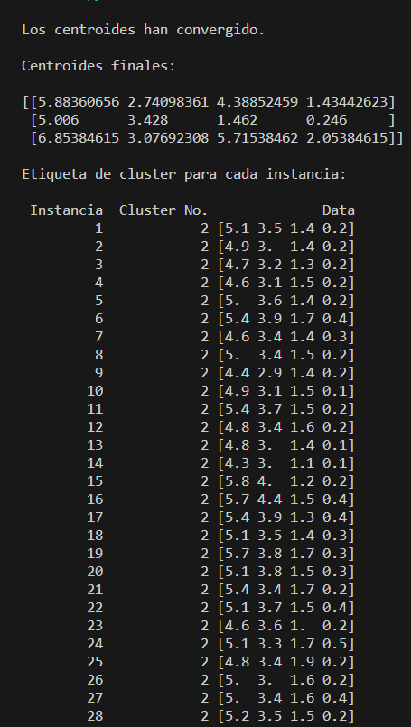

<h1>Practica 7: Implementación del algoritmo K-Means

Materia: Sem. Sistemas Basados en Conocimiento

Profesor: Jorge De Jesus Galves Rodriguez

Fecha: 13/11/23

Duarte Vázquez Kevin Alexis. </h1>

<h2> Resultado:</h2>

